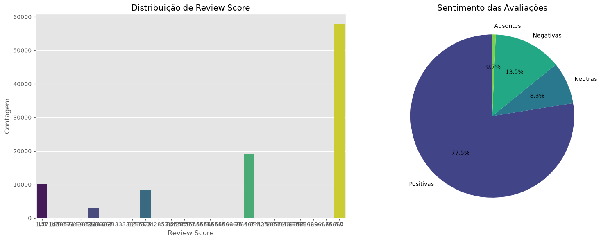
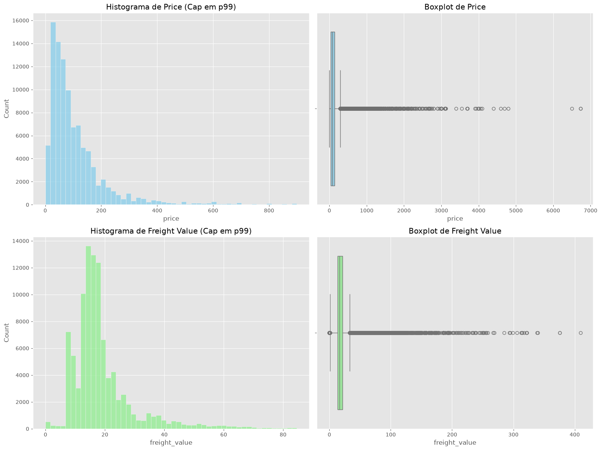
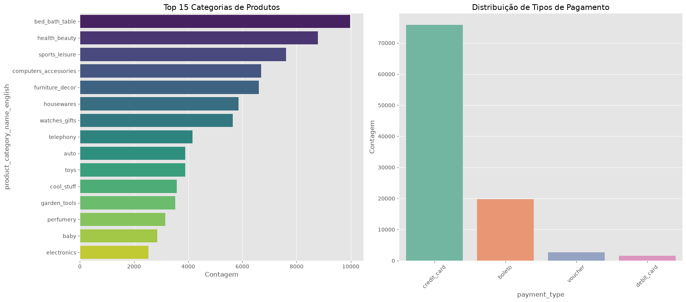
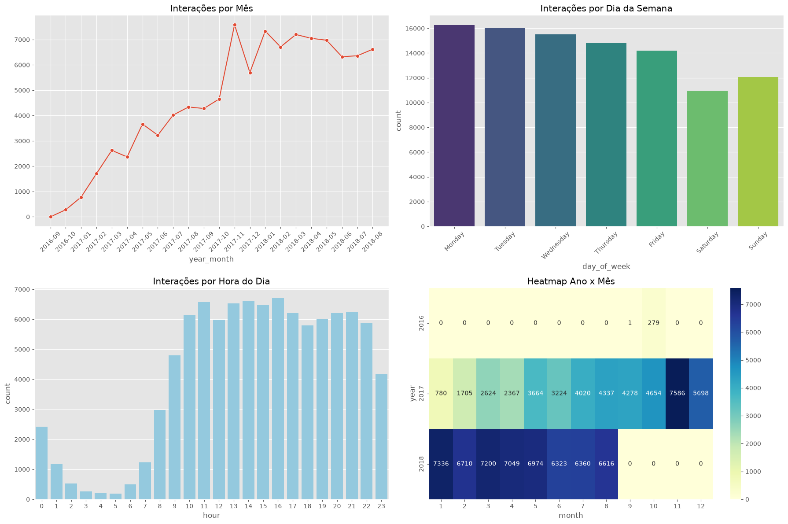
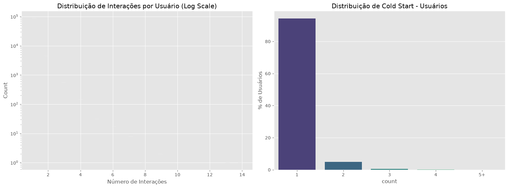
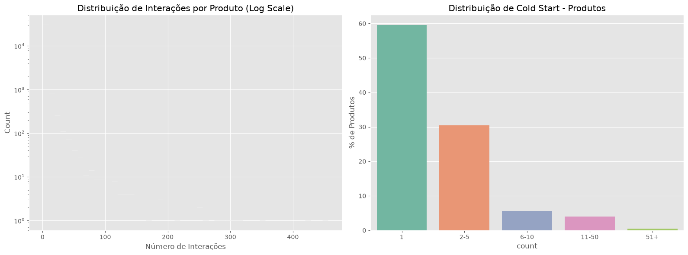
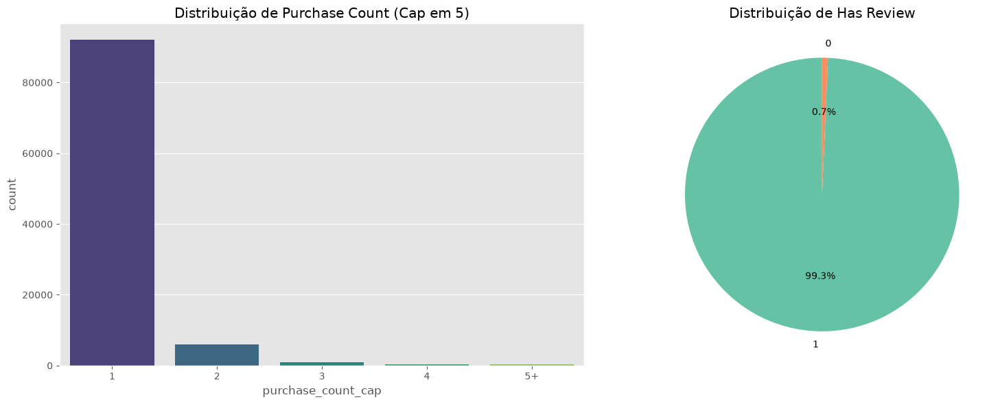
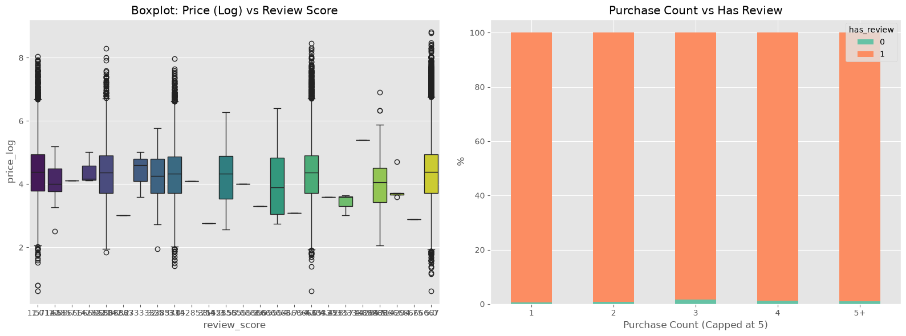

# EDA Report — Olist Interactions Dataset

## 1. Visão Geral
Este documento apresenta a Análise Exploratória de Dados do dataset de interações do Olist, preparado para o desenvolvimento de um Sistema de Recomendação.

## 2. Estatísticas Básicas
- **Total de linhas**: 99785
- **Total de colunas**: 10
- **Uso de Memória**: 31.47 MB
- **Linhas Duplicadas**: 0

## 3. Distribuição do Target (review_score)
A distribuição da variável alvo foi analisada para entender o sentimento geral das compras (positivas >= 4, neutras = 3, negativas <= 2).

## 4. Features Numéricas (price, freight_value)
Análise do comportamento de preços de produtos e custos de frete, incluindo tratamento visual para outliers (ex: clipping no percentil 99).

## 5. Features Categóricas (category, payment_type)
O dataset exibe concentrações significativas em top categorias (head) assim como grande variedade na "cauda longa" (long-tail).

## 6. Análise Temporal
Análise da evolução das interações ao longo dos anos, variação sazonal por meses e comportamentos de dias e horas da compra.

## 7. Comportamento de Usuários
- **Média de interações/usuário**: 1.07
- **Mediana**: 1.00
- **Max**: 14.00

## 8. Comportamento de Produtos
- **Média de interações/produto**: 3.10
- **Mediana**: 1.00
- **Max**: 456.00

## 9. Padrões de Interação
Frequência de recompras e presença/ausência de avaliações após o pedido.

## 10. Análise Bivariada
Correlações entre nota de avaliação e o preço pago, e a relação de recorrência com propensão de fazer reviews.

## 11. Sparsity da Matriz User-Item
A esparsidade da matriz de recomendação afeta o quão "fria" a base se encontra.
- **Usuários únicos**: 93358
- **Produtos únicos**: 32216
- **Total de interações**: 99785
- **Sparsity**: 99.996682%
- *Benchmark MovieLens 1M*: ~95.5% sparsity
- *Benchmark Amazon Reviews*: >99.9% sparsity

## 12. Visualizações Geradas
Todas as visualizações encontram-se na pasta `reports/figures/`:
1. `01_review_score_distribution.png`
2. `02_numerical_distributions.png`
3. `03_categorical_distribution.png`
4. `04_temporal_distribution.png`
5. `05_user_behavior.png`
6. `06_product_behavior.png`
7. `07_interaction_patterns.png`
8. `08_bivariate_analysis.png`

## 13. Conclusões e Recomendações
Com base no exposto, recomenda-se especial atenção à esparsidade na modelagem de recomendação, dada a alta concentração de comportamentos do tipo *cold-start* tanto em usuários quanto em produtos.
